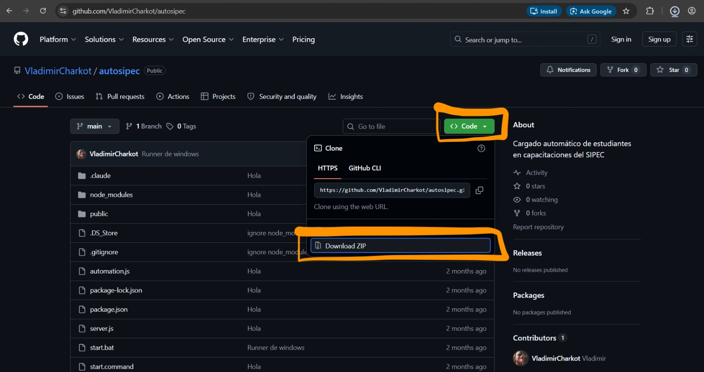
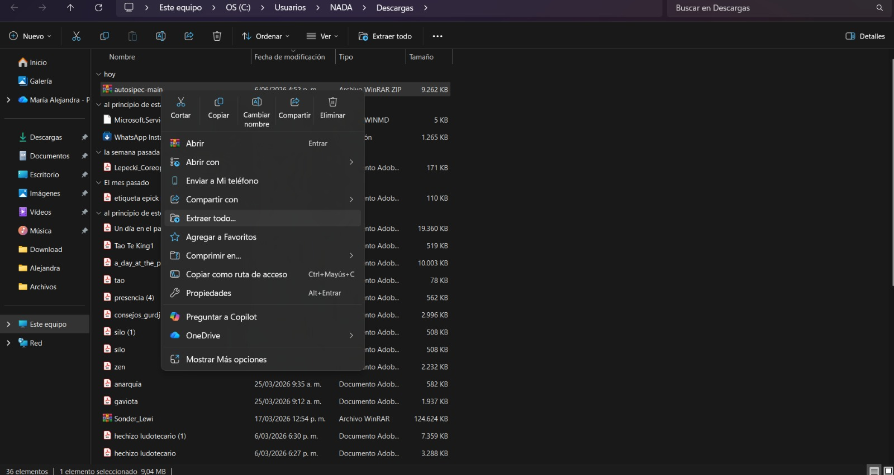
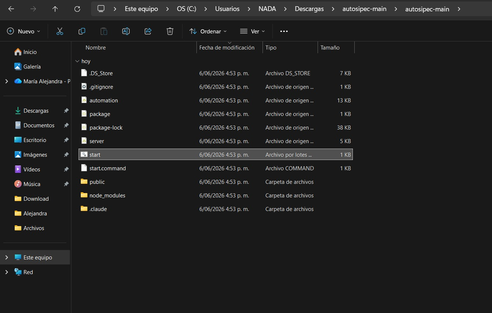
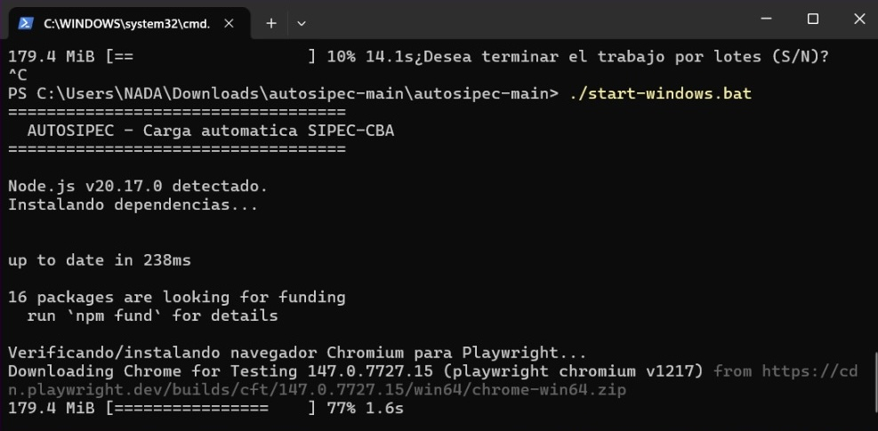
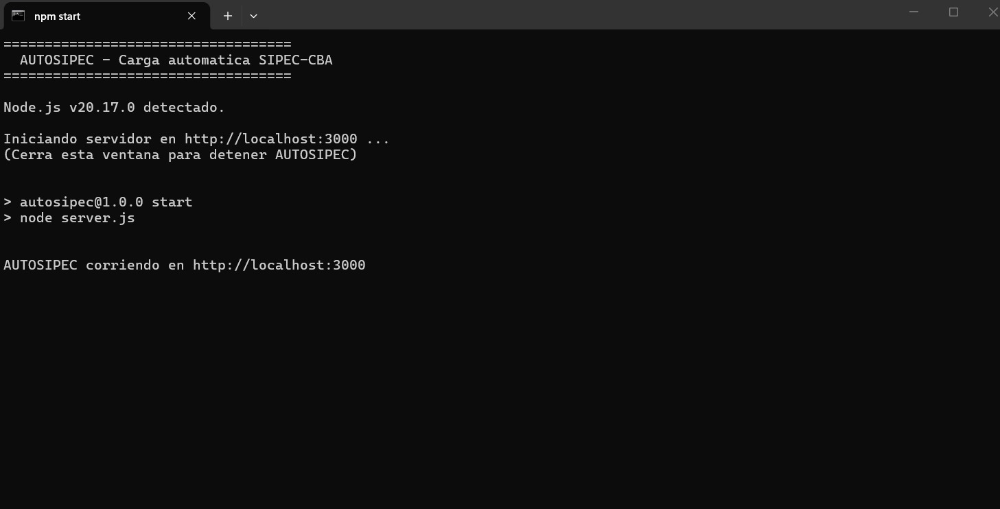
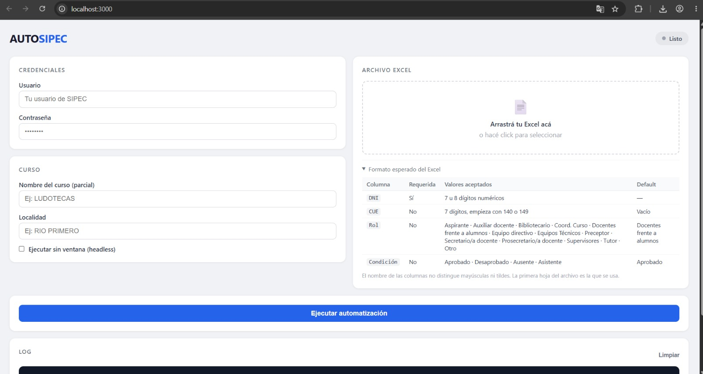
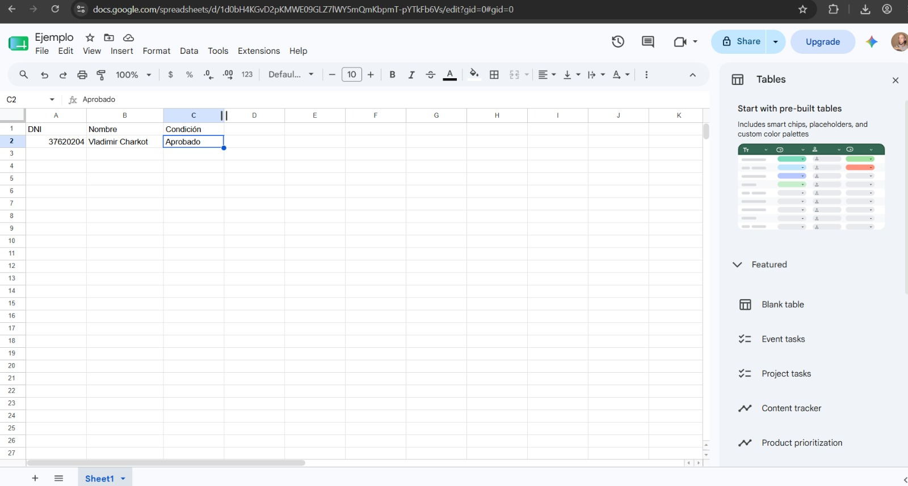
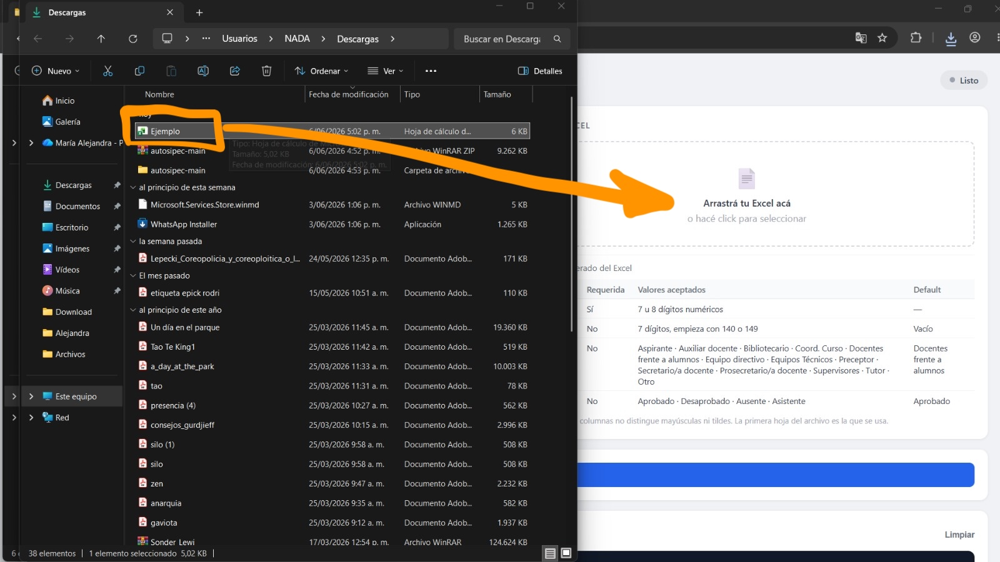
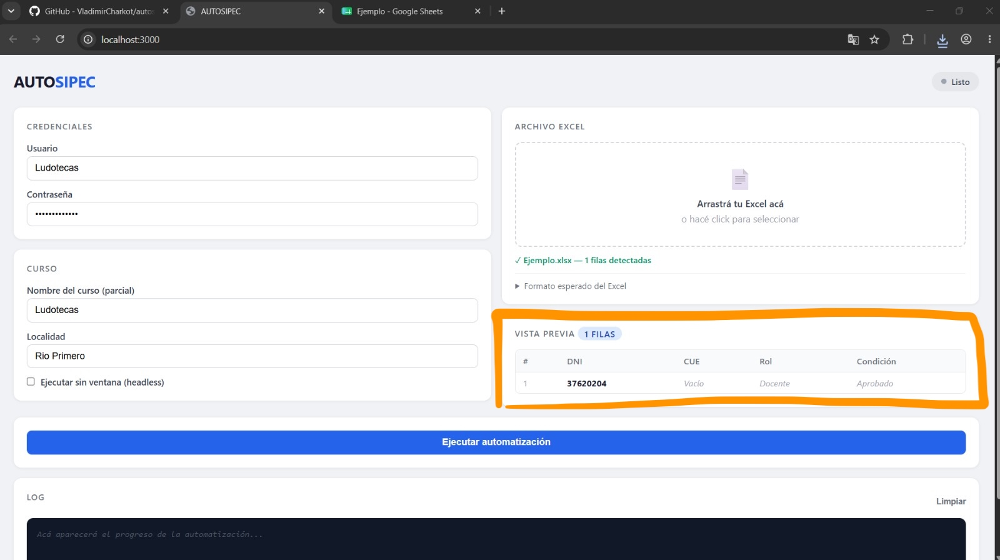
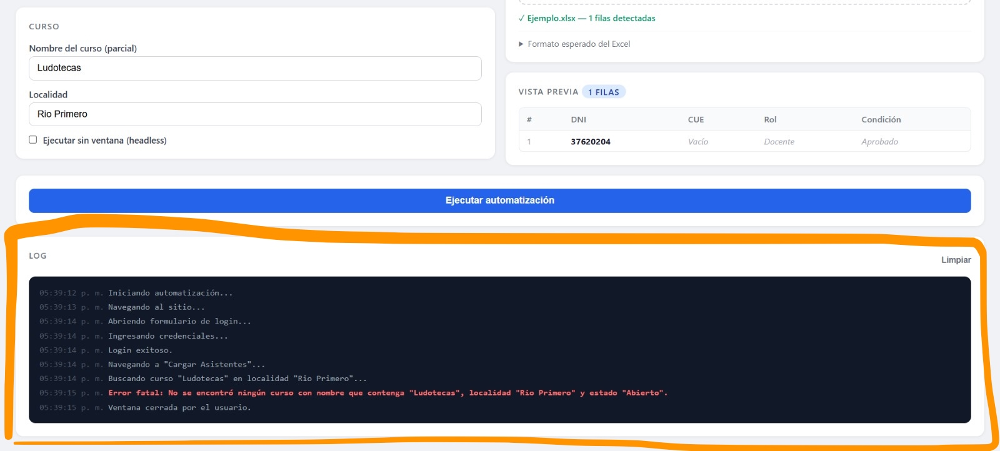

# AUTOSIPEC

Automatización de la carga de asistentes a capacitaciones en **SIPEC-CBA**.

En lugar de cargar uno por uno a los participantes de una capacitación, AUTOSIPEC toma un Excel con la lista de personas y los inscribe automáticamente. Vos solo cargás tus credenciales, el nombre del curso, la localidad y el archivo Excel. El programa **solo carga los estudiantes** y le deja al usuario la confirmación final y la posibilidad de revisar y editar los datos antes de enviar.

---

## Requisitos previos

- **Windows** (este tutorial usa el instalador para Windows).
- **Node.js** instalado (versión LTS recomendada). Si no lo tenés, descargalo desde [nodejs.org](https://nodejs.org).

El resto de las dependencias (incluido el navegador que usa la automatización) se instalan solas la primera vez que ejecutás el programa.

---

## Instalación paso a paso

### 1. Descargar el proyecto desde GitHub (aquí arriba!)

Entrá al repositorio en GitHub, hacé click en el botón verde **Code** y elegí **Download ZIP**.

### 2. Extraer el ZIP

Buscá el archivo descargado, hacé **click derecho** sobre él y elegí **Extraer todo…**. Esto crea una carpeta con todos los archivos del proyecto.

### 3. Ejecutar `start-windows.bat`

Abrí la carpeta extraída y hacé doble click en **`start-windows.bat`**. 

**Nota**: en la imagen a continuación se lee solo `start` pero luego de sacar la captura se actualizó el nombre a `start-windows`. Buscá `start-windows` si estás en windows o `start.command` si estás en mac.

> Si Windows muestra un aviso de seguridad ("Windows protegió tu PC"), hacé click en **Más información → Ejecutar de todas formas**.

### 4. Esperar a que se instalen las dependencias

La primera vez, se abrirá una ventana negra (consola) que instalará automáticamente todo lo necesario. Esto puede tardar unos minutos. **No cierres esta ventana.**

Cuando termine, la consola quedará corriendo la aplicación como a un sitio web en `http://localhost:3000`. Mientras esta ventana esté abierta, AUTOSIPEC está funcionando.

> Para **detener** AUTOSIPEC, simplemente cerrá esta ventana negra.

---

## Cómo usar AUTOSIPEC

### 5. Abrir la interfaz

Abrí tu navegador y entrá a **`http://localhost:3000`**. Vas a ver la pantalla de AUTOSIPEC.

### 6. Completar los datos

En el panel de la izquierda, completá:

- **Usuario** y **Contraseña**: tus credenciales de SIPEC.
- **Nombre del curso (parcial)**: alcanza con una parte del nombre (ej: `LUDOTECAS`).
- **Localidad**: la localidad de la capacitación (ej: `RIO PRIMERO`).

### 7. Preparar el Excel

El Excel debe tener una fila por participante. La única columna obligatoria es el **DNI** (7 u 8 dígitos). Las demás (`CUE`, `Rol`, `Condición`) son opcionales y tienen valores por defecto. Podés ver el detalle del formato en la sección **"Formato esperado del Excel"** de la interfaz.

### 8. Cargar el Excel

Arrastrá tu archivo Excel al recuadro **"Arrastrá tu Excel acá"** (o hacé click para seleccionarlo).

Cuando el archivo se cargue correctamente, vas a ver confirmado que quedó listo.

### 9. Ejecutar la automatización

Hacé click en el botón azul **"Ejecutar automatización"**. AUTOSIPEC va a ingresar a SIPEC y cargar a cada participante.

En el panel **LOG**, debajo del botón, vas a ver el avance en tiempo real y el resultado de cada persona.

> Por defecto se abre una ventana del navegador para que veas lo que va haciendo. Si preferís que trabaje en segundo plano, marcá la opción **"Ejecutar sin ventana (headless)"** antes de ejecutar.

---

¡Listo! Cuando termine, el LOG mostrará el resumen de la carga.

--- 

**Nota**: para poder efectivamente probar y ver el proceso de carga vas a necesitar una capacitación abierta. Esta es la razón por la que no he podido capturar imágenes o grabaciones del sistema funcionando. 